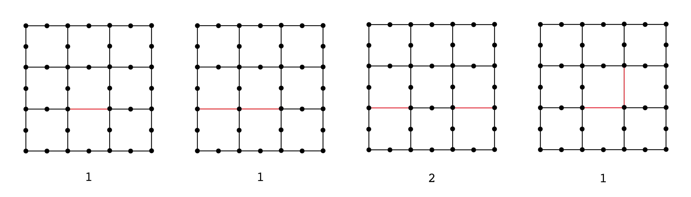

#HouseCanary Python Challenge: Paper Streets
###The Challenge
In the search for great Software Engineers, HouseCanary has an open Python challenge. If you submit a working solution, we'll send you a HouseCanary Python Challenge sticker (anywhere in the US).

This is also an opportunity for job seekers. If you’d like to be considered for a career at HouseCanary, please attach a resume along with your submission. Take a look at our [job openings](http://housecanary.com/careers) and see if you’re a match.

###Problem
Paper streets are streets that are on a map, but do not exist in reality. A street can be planned but never built, and still end up on a map. Map makers also used to use paper streets to catch other companies copying and selling their maps.

Your challenge is to find the number of groups of paper streets on a map. A street is a line segment that starts and ends at intersections. A street is a paper street if it has no homes on it (a home on the end of the street doesn't count). A group is made of paper streets that all share at least one point with one other paper street in that group. 

      
###Counting Paper Streets Groups

###Inputs

The map is a grid of perpendicular lines. It's given to you as a list of X intercepts of vertical lines, then a list of Y intercepts of horizontal lines. The maps vary in size and are bound by the last lines given.

The homes are represented by X and Y coordinates. All numbers given are integers.

    x_intercepts = [0, 2, 4]
    y_intercepts = [0, 2]
    homes = [(0, 0), (0, 1), (0, 2), (1, 0), (1, 2), (2, 0), (2, 2), (3, 0), (3, 2), (4, 0), (4, 1), (4, 2)]

    2 X---X---X---X---X
      |       |       |
    1 X       |       X
      |       |       |
    0 X---X---X---X---X
      0   1   2   3   4

###Implementation
Modify the function `count_paper_streets` in solution.py to return the number of paper streets.

###Tests
A test suite is included. Use `python -m unittest tests` to run it. Look to the test output for examples.

###Environment
Your code will be run on either Python 2.7.6 or 3.5.1 with Numpy installed. Our test runner tries Python 2 first, then 3 if there's a failure.

###Submitting
Copy your `solution.py` into a secret [GitHub Gist](https://gist.github.com/) and send the link to challenge@housecanary.com. Include your mailing address in your email if you'd like a HouseCanary Python Challenge sticker. Make sure to attach your resume if you’re interested in a career at [HouseCanary](http://housecanary.com/careers).

###Fine Print
Prizes are while supplies last. Code must be the entrant's original work, and HouseCanary may refuse prizes for detected plagiarism. Prizes will be sent to USA addresses only. Limit one prize per household. Challenge may end at any time.